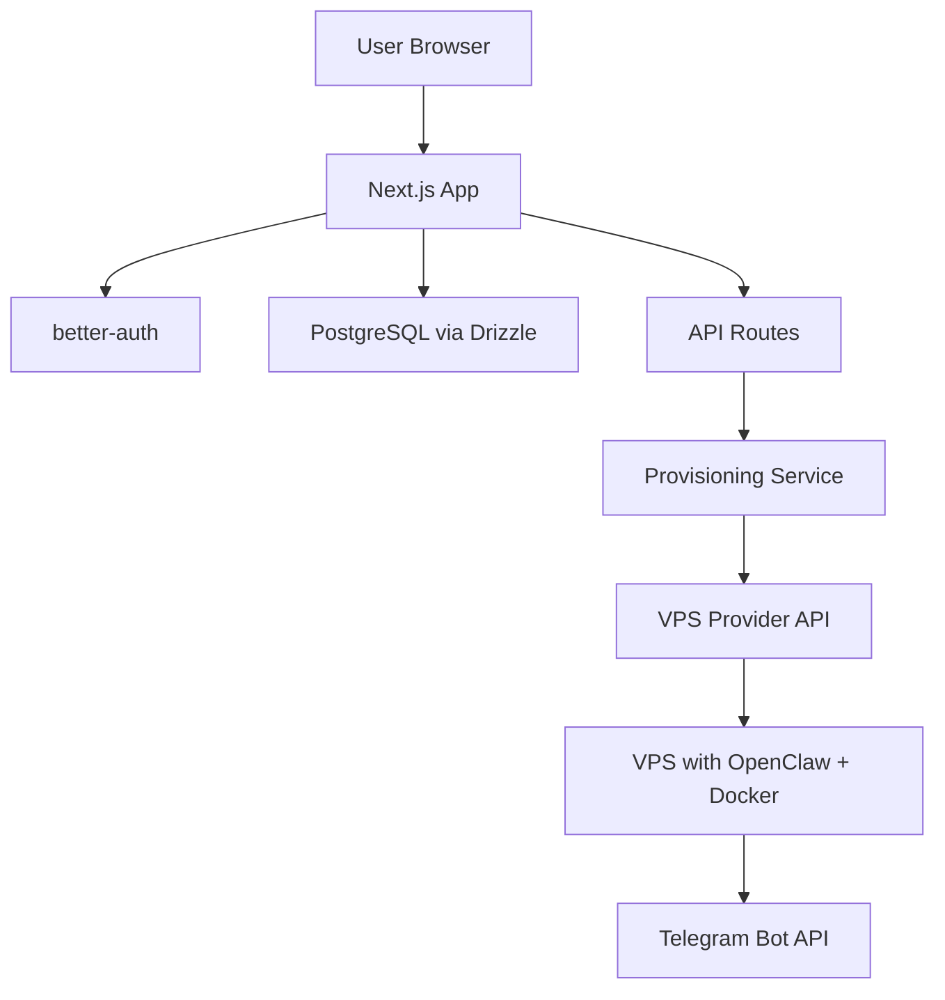

# PapayaClaw — MVP Plan

## Vision

**PapayaClaw** is a managed deployment platform that lets **non-technical users** deploy [OpenClaw](https://github.com/openclaw/openclaw) (an open-source personal AI assistant) to a cloud VPS in under 1 minute — no SSH, no Docker, no YAML.

> **One-liner:** *"Heroku for OpenClaw."*

---

## Target Audience

| Segment | Pain Point |
|---------|-----------|
| **Non-technical enthusiasts** | Want a personal AI assistant on Telegram but can't set up a server |
| **Small business owners** | Need a 24/7 customer support / assistant bot without hiring a developer |
| **AI hobbyists** | Want to experiment with OpenClaw but don't want DevOps overhead |

---

## Core MVP Features

### 1. Landing Page ✅
- Hero with value proposition ("Deploy OpenClaw under 1 minute")
- Interactive model + channel configurator preview
- Comparison section (Traditional vs PapayaClaw)
- Use case badges

### 2. Auth ✅
- Google OAuth via better-auth
- Session management with secure cookies

### 3. Dashboard ✅
- List all user instances with status, model, channel
- Empty state CTA for first deployment
- Start / Stop / Delete instance actions

### 4. Deploy Wizard ✅
A 3-step dialog flow:

```
Step 1: Name & Model     →  Step 2: Channel & Token  →  Step 3: Review & Deploy
├─ Instance name          ├─ Telegram (active)        ├─ Summary card
├─ Claude Opus 4.5        ├─ Discord (coming soon)    └─ Deploy button
├─ GPT-5.2                ├─ WhatsApp (coming soon)
├─ Gemini 3 Flash Preview ├─ Slack (coming soon)
└─ Custom / BYO key       └─ Bot token input
```

### 5. 🔴 VPS Provisioning Backend (NOT BUILT — critical MVP gap)
The actual server-side logic to:
- Provision a VPS (Hetzner Cloud)
- Install OpenClaw via Docker on the VPS
- Configure the selected AI model + Telegram bot token
- Report status back to the dashboard (deploying → running)
- Handle start/stop/delete lifecycle

### 6. 🔴 Instance Health Monitoring (NOT BUILT)
- Periodic health checks on deployed instances
- Auto-update status if instance goes down
- Basic uptime indicator on dashboard cards

---

## Tech Stack

| Layer | Technology | Status |
|-------|-----------|--------|
| **Frontend** | Next.js 16, React 19, Tailwind CSS 4 | ✅ |
| **UI Components** | shadcn/ui (new-york style, dark mode) | ✅ |
| **Auth** | better-auth (Google OAuth) | ✅ |
| **Database** | PostgreSQL + Drizzle ORM | ✅ |
| **API** | Next.js Route Handlers | ✅ |
| **VPS Provider** | Hetzner Cloud | 🔴 |
| **Provisioning** | Docker + SSH (or provider API) | 🔴 |
| **Payments** | Stripe (TBD) | 🔴 |

---

## Architecture



---

## MVP Phases

### Phase 0 — Foundation ✅ Complete
- [x] Landing page with brand identity
- [x] Google OAuth sign-in
- [x] Database schema (user, session, account, verification)

### Phase 1 — Dashboard UI ✅ Complete
- [x] `instance` table in DB
- [x] API routes (GET/POST/PATCH/DELETE instances)
- [x] Dashboard layout with auth guard
- [x] Instance card grid with status badges
- [x] 3-step deploy wizard dialog
- [x] Header navigation update

### Phase 2 — Provisioning Backend 🔴 Next Priority
- [ ] Build Hetzner provisioning service (create VPS via API → install Docker → deploy OpenClaw)
- [ ] Wire deploy wizard to provisioning (on "Deploy" → actually create a server)
- [ ] Implement start/stop/delete via provider API
- [ ] Store VPS metadata (IP, provider ID) in `instance` table
- [ ] Status webhook or polling to update instance status

### Phase 3 — Reliability & Monitoring
- [ ] Health check cron (ping deployed instances every 5 min)
- [ ] Auto-restart on failure
- [ ] Instance logs viewer in dashboard
- [ ] Email/Telegram notifications on downtime

### Phase 4 — Monetization
- [ ] Stripe integration for subscription billing
- [ ] Pricing tiers (Free trial → Starter → Pro)
- [ ] Usage metering (uptime hours, API calls)
- [ ] Payment management page in dashboard

### Phase 5 — Channel Expansion
- [ ] Discord channel support
- [ ] WhatsApp channel support
- [ ] Slack channel support
- [ ] Multi-channel per instance

---

## Key Decisions Needed

| Decision | Options | Impact |
|----------|---------|--------|
| **Provisioning method** | Hetzner Cloud API vs pre-provisioned pool (faster deploys) | Deploy speed, complexity |
| **Pricing model** | Monthly subscription vs pay-per-hour vs flat fee | Revenue, churn |
| **Instance limit** | Fixed per plan vs unlimited | Server costs |
| **OpenClaw version** | Pin to specific release vs auto-update | Stability |

---

## Success Metrics for MVP Launch

| Metric | Target |
|--------|--------|
| Deploy time (user clicks "Deploy" → bot responds on Telegram) | < 2 minutes |
| Instance uptime | 99.5%+ |
| Active deployments | 10 paid users within first month |
| Churn rate | < 10% monthly |
